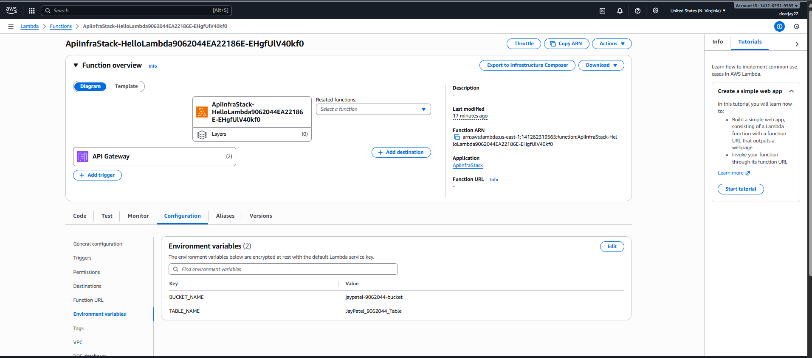
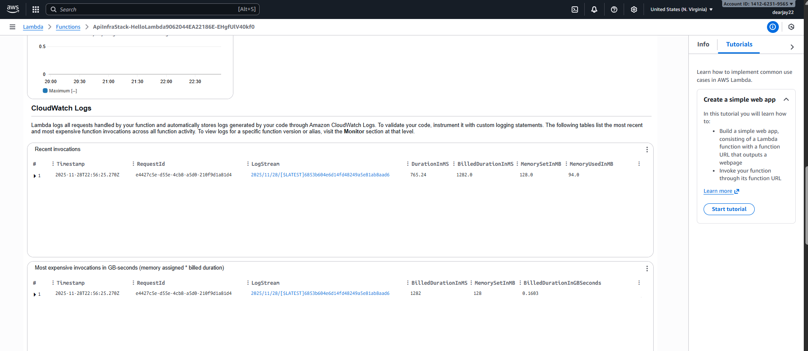
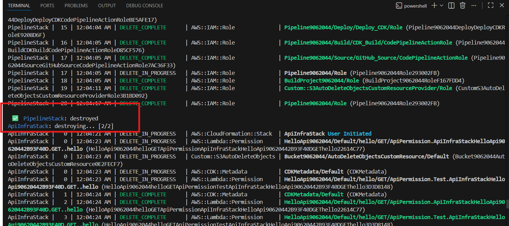
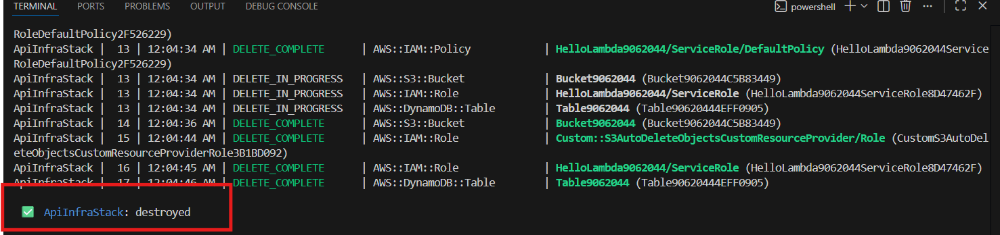

# AWS CDK Automated Deployment Pipeline

This repository demonstrates an **automated AWS CDK infrastructure deployment** using CodePipeline, CodeBuild, and CloudFormation.

---

## Prerequisites

1. **AWS Account** with sufficient permissions:

   * CloudFormation
   * CodePipeline
   * CodeBuild
   * IAM
   * CDK deployment permissions

2. **AWS CLI** installed and configured:

   ```bash
   aws configure
   ```

3. **AWS CDK CLI** installed:

   ```bash
   npm install -g aws-cdk
   ```

4. Python 3.11 and pip installed.

---

## Steps to Reproduce

1. **Clone the repository**:

   ```bash
   git clone https://github.com/dearjay22/Automated-Infrastructure-Deployment-with-AWS-CDK-CodePipeline.git
   cd Automated-Infrastructure-Deployment-with-AWS-CDK-CodePipeline
   ```

2. **Install Python dependencies**:

   ```bash
   pip install --upgrade pip
   pip install -r requirements.txt
   ```

3. **Bootstrap CDK environment** (if first time):

   ```bash
   cdk bootstrap aws://<ACCOUNT_ID>/<REGION>
   ```

4. **Deploy the pipeline**:

   ```bash
   cdk deploy PipelineStack --require-approval never
   ```

5. **Pipeline Flow**:

   * **Source Stage**: Pulls code from GitHub.
   * **Build Stage**: Synthesizes CDK templates (`cdk synth`) and stores in `cdk.out`.
   * **Deploy Stage**: Deploys the `ApiInfraStack` using CloudFormation templates from build artifacts.

---

## Notes

* **Do not run `cdk deploy --all` in CodeBuild**; the pipeline deploys automatically.
* Ensure the **CodeStar Connections ARN** is updated in `PipelineStack.py` to your own GitHub connection.
* Synthesized CloudFormation templates are stored in `cdk.out/` and used as pipeline artifacts.
* Node.js v18 is deprecated. Consider upgrading to v20+ for future CDK releases.

---

## Screenshots

# Deploy


# API Gateway and Test


# Lambda Function








# CloudWatch


# S3 Bucket


# DynamoDB Table


# CodePipeline


# Cleanup


